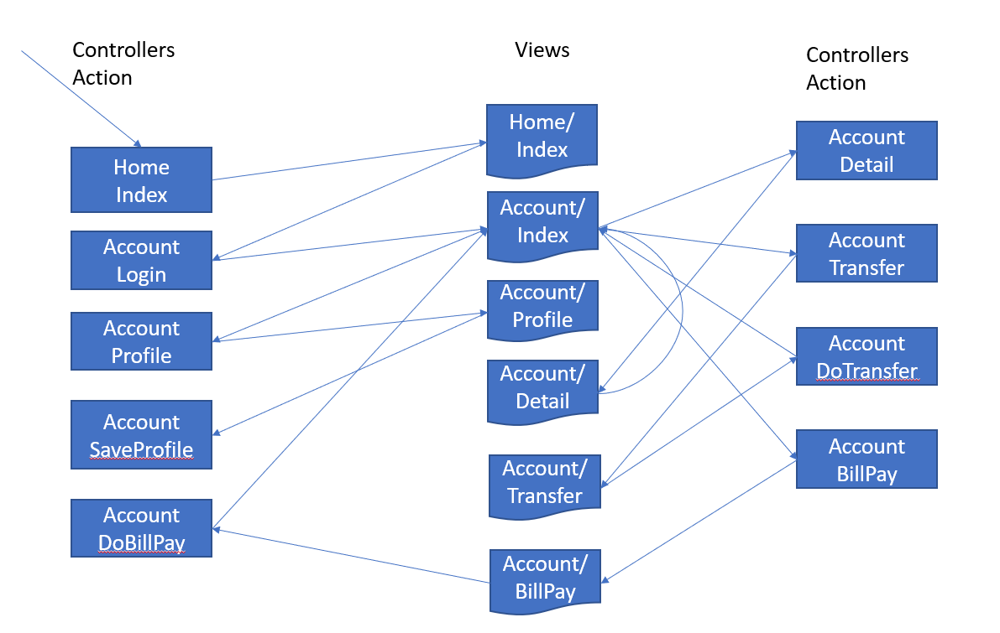

## Overview 
Case Study: Setup and
    Analysis

|    |     |  
| --------------|--------|
| Overview      |  You will examine a description and implementation of an application that we will be using during much of the remainder of this course. You will then open the course web application in Visual Studio, deploy it to Internet Information Services, and explore how the application works.    |
Objective | Understand the case study for this course as well as how to work with and run it.        | 
| Builds on Previous Labs    | yes          | 
| Approximate time           | 40 minutes   | 

### Task List

- Review background of application
- Open and deploy the Acme Bank application
- Familiarize yourself with database tools in Visual Studio
- Examine implementation architecture

**Note:** Take your time with this lab, examining the components, how they work, and what they do. This will be beneficial for subsequent discussions and activities.

#### Review background of application

1.  Spend a few minutes and read through application description below:

Acme Bank has an existing online banking system that customers can use to review their accounts, update personal information, and transfer funds among accounts.

#### Functional Requirements:

- Customers should be able to log on to the system using a user id and password.
- There should be a time out capability that will end a session after a predetermined period of inactive time.
- Customers can update their email address, phone, name, and passwords.
- There should be a consistent error-handling mechanism to provide feedback to the customer when there are problems.
- Customers should be able to view account transactions.
- Customers should be able to transfer funds between their own accounts.

- Customers can pay bills to third party payees

Open and configure the AcmeBank solution

1.  Choose File, Open project from the menu. Select *AcmeBank.sln* from
    *StudentWork/Labs/AcmeBank-Initial*

2.  This will open all the files for the case study web site.
3.  If you are using VS Code, open an integrated terminal in the AcmeWeb folder and run `libman restore` to restore the css & js libraries.

3.  This solutions uses SQLite as the database.

  2.  Run the application. On the home page, click on *Reset Database*
      to create the initial database.

**Note** – you may have to right click on *AcmeWebsite* and choose *Set
as startup project*

> Nuget Packages: Some students report issues with Nuget packages. Packages are not provided with the starter files. Check *Tools/Nuget Package Manager/Package Manager Settings* and verify that Nuget can download missing packages
5.  Note – you can run *reset database* at any time to reset the
    database.

6. Review *wwwroot/DbReset.sql*. This is used to reset the database.

Examine implementation architecture

***This application is intentionally flawed. It contains design and code
errors that commonly occur in real applications. These flaws lead to the
exploits that we will demonstrate during the course. Please be advised
that this application is not intended to be a demonstration of best
practices.***

- We are now going to fast-forward from the functional description and
  assume that a design has been implemented for the banking application.

- The implementation of this application is contained in two projects.
  **AcmeLib** is a library project that contains the data access layer.

- The class **BankService** provides the “back-end” functionality for
  the website.

- **AcmeWebsite** is an ASP.Net core MVC web application. The entry
  point for the web application is the Home/Index page.

- The Home/Index page has a login form and the *reset db* link.

- Upon logging in, the user is redirected to *Account/Index*, which has
  links for the various requirements.

- The links and functionality do meet the functional requirements that
  you reviewed in the first step in this exercise. All functionality is
  in place and working. Please examine the functionality and threads of
  processing for each set of links, verifying to your satisfaction that
  the application performs as advertised:

- Existing username/passwords include **hank@propane.com/propane**,
  **peggy@yahoo.com/boggle**, and **luann@yahoo.com/blondie**. The
  update capability allows you to update the password for an existing
  user.

- The profile page can be used to update user information.

- The account home page also displays a list of accounts that belong to the user.

- Clicking on an account shows the ledger for the account

- The transfer page allows the user to transfer money from one account
  to another. Check the account ledger after a transfer to verify.
